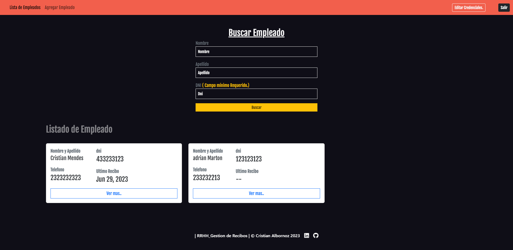

 

# RRHH. Gestión de Recibos.

 
 

 
 
 
 
 

## Introducción.

 

- RRHH. Gestión tiene como objetivo facilitar la administración y gestión de empleados y sus recibos.
  Ya que cada uno cuenta con una cuenta.
   
  El RRHH Administra y Gestiona los empleados y sus recibos. 
  Las tecnologías que utilizadas son Spring Boot (con Spring JPA, Spring Security y JWT, MYSQL) en el backend, y Angular (con Bootstrap) en el frontend.

 

## Características principales

 

- Cada Usuario cuenta con una cuenta basada en un rol (Amín/user).
   
- Cada usuario cuenta con una ruta e interfaz propia basada en su rol.
   
- La carga de archivos (recibos) debe ser máximo 5mb.
   
  Estos archivos se guardan localmente y pero su referencia se guarda en la DB para su posterior lectura.
   
- La seguridad está basada en roles.
   
  Bajo el marco de spring boot y filtros en conjunto con jwt.
   

## Tecnologías Utilizadas.

 

- Spring Boot 3.0 (Spring JPA | Spring Security 6 | java 17)
- Angular (Bootstrap)
- Mysql
- JWT

## Instalación y ejecución

1. Descargar Repositorio
2. Abra la carpeta back con su editor de código, tiene que configurar:
    - Su db (mysql) en el properties.
    - El secret shh de jwt, en el archivo JwtService.
    - La uri de cors, en el archivo CorsFig.
    - El email y password de para el envió de mail, en el archivo properties y el Utils/emailConfig/Email.
    
   Luego Solo inicie el proyecto Spring Boot.
3. Abra la carpeta front con su editor de código, solo tiene que instalar las dependencias con npm i y brindar a los services la uri del backend para las consultas.   Y luego solo ejecutar el proyecto Angular
4. Listo.

## Contribución

- Si tienes sugerencias o mejoras puedes decírmelas.

## Contacto

- Si tienes alguna pregunta o inquietud relacionada con este proyecto, no dudes en ponerte en contacto con ema9948@gmail.com o https://cristianalbornoz.ml/

¡Gracias por utilizar nuestra aplicación de gestión de reparaciones de aparatos electrónicos! Esperamos que te sea de gran utilidad.

## Features

- \*\***\*\*\*\***
